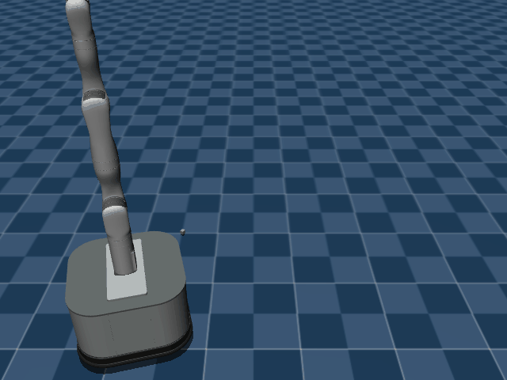

# prbench/TidyBot3D-base_motion-o1-v0

### Description
A 3D mobile manipulation environment using the TidyBot platform.

The robot has a holonomic mobile base with powered casters and a Kinova Gen3 arm.
Scene type: base_motion with 1 objects.

The robot can control:
- Base pose (x, y, theta)
- Arm position (x, y, z)
- Arm orientation (quaternion)
- Gripper position (open/close)

### Initial State Distribution

### Example Demonstration
*(No demonstration GIFs available)*

### Observation Space
The entries of an array in this Box space correspond to the following object features:
| **Index** | **Object** | **Feature** |
| --- | --- | --- |
| 0 | cube1 | x |
| 1 | cube1 | y |
| 2 | cube1 | z |
| 3 | cube1 | qw |
| 4 | cube1 | qx |
| 5 | cube1 | qy |
| 6 | cube1 | qz |
| 7 | robot | pos_base_x |
| 8 | robot | pos_base_y |
| 9 | robot | pos_base_rot |
| 10 | robot | pos_arm_joint1 |
| 11 | robot | pos_arm_joint2 |
| 12 | robot | pos_arm_joint3 |
| 13 | robot | pos_arm_joint4 |
| 14 | robot | pos_arm_joint5 |
| 15 | robot | pos_arm_joint6 |
| 16 | robot | pos_arm_joint7 |
| 17 | robot | pos_gripper |
| 18 | robot | vel_base_x |
| 19 | robot | vel_base_y |
| 20 | robot | vel_base_rot |
| 21 | robot | vel_arm_joint1 |
| 22 | robot | vel_arm_joint2 |
| 23 | robot | vel_arm_joint3 |
| 24 | robot | vel_arm_joint4 |
| 25 | robot | vel_arm_joint5 |
| 26 | robot | vel_arm_joint6 |
| 27 | robot | vel_arm_joint7 |
| 28 | robot | vel_gripper |

### Action Space
Actions: base_pose (3), arm_pos (3), arm_quat (4), gripper_pos (1)

### Rewards
Reward function depends on the specific task:
- Object stacking: Reward for successfully stacking objects
- Drawer/cabinet tasks: Reward for opening/closing and placing objects
- General manipulation: Reward for successful pick-and-place operations

Currently returns a small negative reward (-0.01) per timestep to encourage exploration.

### References
TidyBot++: An Open-Source Holonomic Mobile Manipulator
for Robot Learning
- Jimmy Wu, William Chong, Robert Holmberg, Aaditya Prasad, Yihuai Gao,
  Oussama Khatib, Shuran Song, Szymon Rusinkiewicz, Jeannette Bohg
- Conference on Robot Learning (CoRL), 2024

https://github.com/tidybot2/tidybot2
